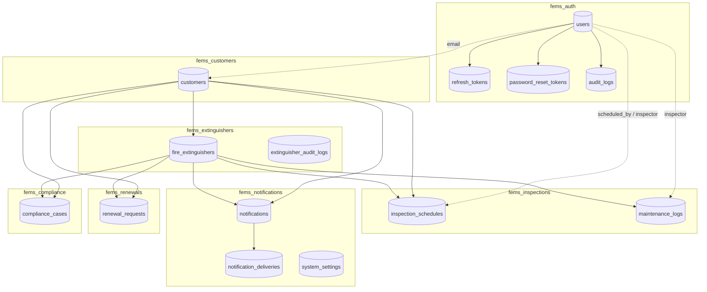
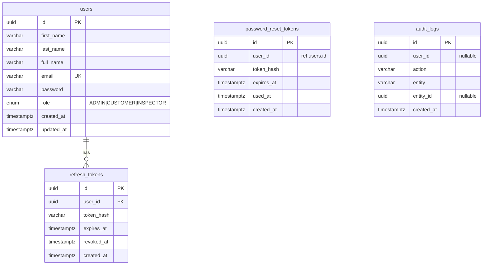
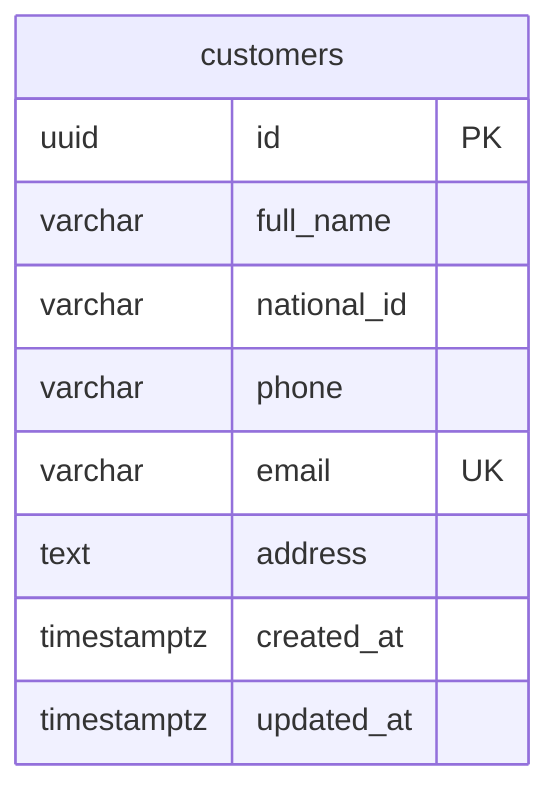
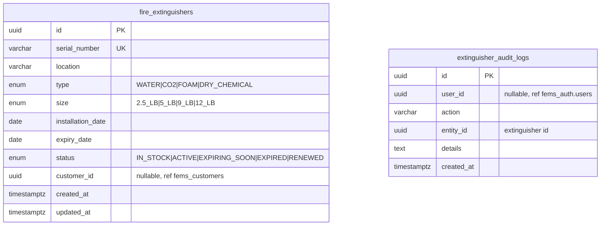
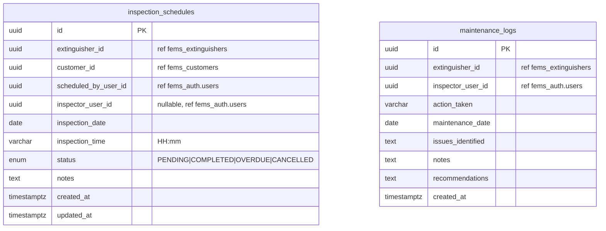
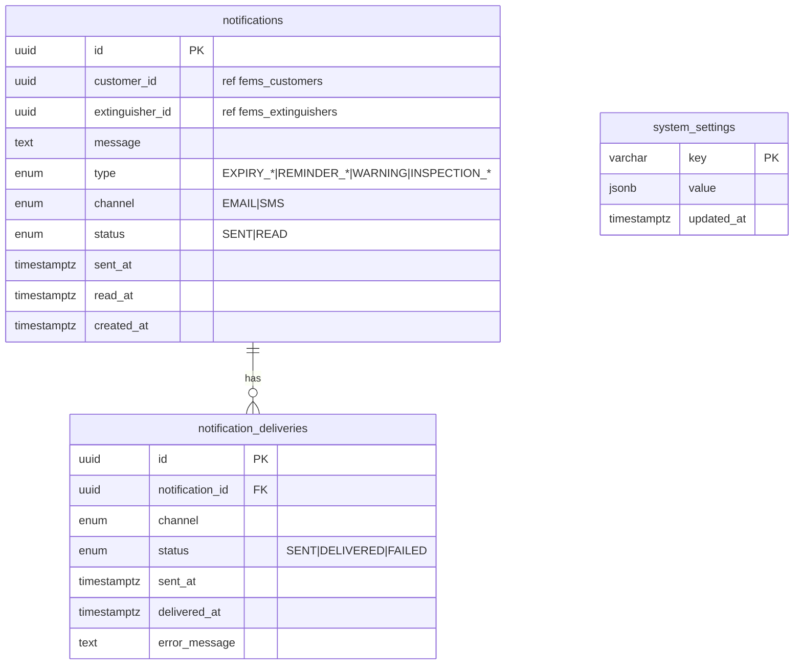
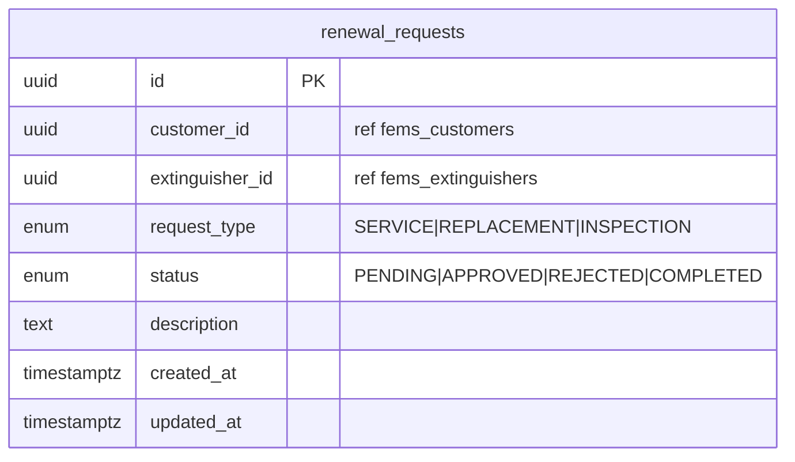
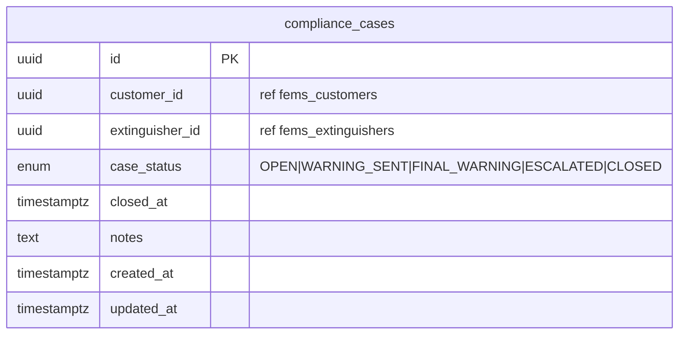
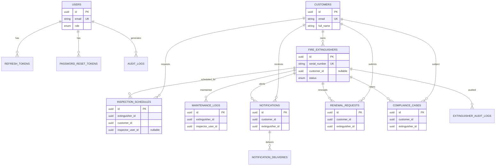

# FEMS Database Structure (Mermaid ERD)

FEMS uses **database-per-service** on PostgreSQL. Cross-service links are **logical UUID references** (no foreign keys across databases). Identity is linked at runtime via `users.email` = `customers.email`.

## Export schema from a running Postgres

```bash
npm run export:schema
# Full backup (schema + data):
npm run backup:databases
```

Output: `database-export/<timestamp>/*.schema.sql`

---

## 1. System overview (logical, cross-database)



---

## 2. fems_auth (physical FKs)



---

## 3. fems_customers



---

## 4. fems_extinguishers



---

## 5. fems_inspections



---

## 6. fems_notifications



---

## 7. fems_renewals



---

## 8. fems_compliance



---

## 9. Consolidated logical ERD (all entities)



**Note:** `USERS` and `CUSTOMERS` are linked by matching `email`, not a database foreign key.
